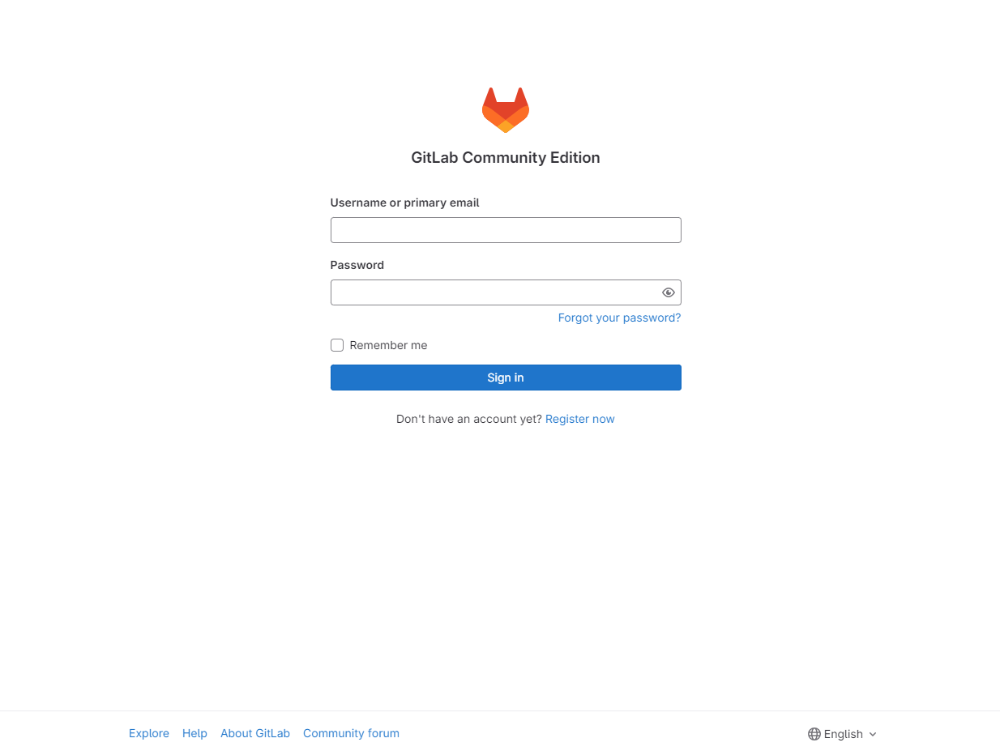

# GitLab 설치 가이드
## Index
- 설치 방법
    - 설치 환경
    - 설치 과정
    - 실행
    - 환경설정
    - 추가 설치(선택)
- 주의사항
    - 최소사양
- GitLab이란
    - GitLab CE vs EE
- 참고자료

## 설치 방법

### 설치 환경
- 서버 정보 : 4vCPU, 8GB Mem, 50GB Disk
    - CPU : Intel(R) Xeon(R) Gold 5120 CPU @ 2.20GHz
- OS : CentOS 7.8 (64-bit)

### 설치 과정
- [GitLab 공식 설치 패키지(centos7)](https://about.gitlab.com/install/#centos-7)

#### 필수의존성 파일 설치하기
1. openssh
- 설치하기
    ```bash
    sudo yum install -y curl policycoreutils-python openssh-server openssh-clients
    ```
- 부팅시 자동 실행하기
    ```bash
    sudo systemctl enable sshd
    sudo systemctl start sshd
    ```

#### GitLab 패키지 설치
- 설치 패키지 : `gitlab-ce`
1. 패키지 저장소 등록
    ```bash
    curl -sS https://packages.gitlab.com/install/repositories/gitlab/gitlab-ce/script.rpm.sh | sudo bash
    ```

2. 패키지 설치
    ```bash
    sudo EXTERNAL_URL="자신의 도메인이나 접속가능한 IP:접속할 Port번호" yum install -y gitlab-ce
    ```
- 예시
    ```bash
    sudo EXTERNAL_URL="192.168.0.102:9999" yum install -y gitlab-ce
    ```
3. 확인
- 터미널에 여우가 등장하면 성공!

### 실행
- EXTERNAL_URL에 설정했던 주소(여우에 있는 주소)를 들어가면 gitlab 페이지 뜸

- 

### 환경설정

### 추가 설치(선택)
1. Postfix
- 설치하기
    ```bash
    sudo yum install postfix
    ```
- 부팅시 자동 실행하기
    ```bash
    sudo systemctl enable postfix
    sudo systemctl start postfi
    ```
- 오류 발생시
    - 정상작동 확인
        ```bash
        systemctl start postfix.service # 실행

        Job for postfix.service failed because the control process exited with error code. See "systemctl status postfix.service" and "journalctl -xe" for details.
        # 이렇게 오류가 나왔다면 다음 단계
        ```
    - 상태확인
        ```bash
        systemctl status postfix.service # 상태확인

        ● postfix.service - Postfix Mail Transport Agent
        Loaded: loaded (/usr/lib/systemd/system/postfix.service; enabled; vendor preset: disabled)
        Active: failed (Result: exit-code) since Fri 2018-04-13 14:39:14 KST; 10s ago
        Process: 12901 ExecStart=/usr/sbin/postfix start (code=exited, status=1/FAILURE)
        Process: 12898 ExecStartPre=/usr/libexec/postfix/chroot-update (code=exited, status=0/SUCCESS)
        Process: 12893 ExecStartPre=/usr/libexec/postfix/aliasesdb (code=exited, status=75)

        Apr 13 14:39:12 server systemd[1]: Starting Postfix Mail Transport Agent...
        Apr 13 14:39:12 server aliasesdb[12893]: /usr/sbin/postconf: fatal: parameter inet_interfaces: no local interface found for ::1
        Apr 13 14:39:13 server aliasesdb[12893]: newaliases: fatal: parameter inet_interfaces: no local interface found for ::1
        Apr 13 14:39:13 server postfix[12901]: fatal: parameter inet_interfaces: no local interface found for ::1
        Apr 13 14:39:14 server systemd[1]: postfix.service: control process exited, code=exited status=1
        Apr 13 14:39:14 server systemd[1]: Failed to start Postfix Mail Transport Agent.
        Apr 13 14:39:14 server systemd[1]: Unit postfix.service entered failed state.
        Apr 13 14:39:14 server systemd[1]: postfix.service failed.
        # 이렇게 오류가 나왔다면 다음 단계
        ```
    - 설정파일 확인
        ```bash
        postfix check

        postfix: fatal: parameter inet_interfaces: no local interface found for ::1
        # 이렇게 오류가 나왔다면 다음단계
        ```
    - 설정파일 수정
        ```bash
        vi /etc/hosts
        ```
        - 편집기를 통해 ::1앞에 #을 넣어서 주석처리
        ```bash
        127.0.0.1   localhost localhost.localdomain localhost4 localhost4.localdomain4
        #::1         localhost localhost.localdomain localhost6 localhost6.localdomain6
        ```
    - 서비스 상태 확인
        ```bash
        systemctl status postfix.service

        ● postfix.service - Postfix Mail Transport Agent
         Loaded: loaded (/usr/lib/systemd/system/postfix.service; enabled; vendor preset: disabled)
         Active: active (running) since Fri 2018-04-13 15:13:19 KST; 9s ago
        Process: 5233 ExecStop=/usr/sbin/postfix stop (code=exited, status=0/SUCCESS)
        Process: 5261 ExecStart=/usr/sbin/postfix start (code=exited, status=0/SUCCESS)
        Process: 5258 ExecStartPre=/usr/libexec/postfix/chroot-update (code=exited, status=0/SUCCESS)
        Process: 5255 ExecStartPre=/usr/libexec/postfix/aliasesdb (code=exited, status=0/SUCCESS)
        Main PID: 5333 (master)
        CGroup: /system.slice/postfix.service
                ├─5333 /usr/libexec/postfix/master -w
                ├─5334 pickup -l -t unix -u
                └─5335 qmgr -l -t unix -u

        Apr 13 15:13:18 server systemd[1]: Starting Postfix Mail Transport Agent...
        Apr 13 15:13:19 server postfix/postfix-script[5331]: starting the Postfix mail system
        Apr 13 15:13:19 server postfix/master[5333]: daemon started -- version 2.10.1, configuration /etc/postfix
        Apr 13 15:13:19 server systemd[1]: Started Postfix Mail Transport Agent.
        # 이와 같은 결과가 나온다면 성공
        ```
    - 부팅시 자동 실행하기
    ```bash
    sudo systemctl enable postfix
    sudo systemctl start postfi
    ```
2. 방화벽
    ```bash
    yum install firewalld
    systemctl enable firewalld # 부팅시 자동 설정
    systemctl start firewalld # on
    systemctl stop firewalld # off
    ```

## 주의사항
- [GitLab공식문서 - 최소사양](https://docs.gitlab.com/ee/install/requirements.html)

## GitLab이란
### GitLab CE VS EE
- GitLab CE
    - 무료
- GutLab EE
    - 유료
    - 유료티어 업그레이드 가능


### GitLab CE 사용하는 이유
- 오픈 소스 소프트웨어 기능만 사용하려는 경우 Community Edition이 최선의 선택입니다. 이 배포에는 독점 코드가 포함되어 있지 않습니다. 기능적으로는 라이선스 키가 없는 Enterprise Edition과 동일하게 작동합니다.
- 향후 Enterprise Edition으로 전환하기로 결정한 경우, 업그레이드가 필요하며 다운타임이 필요할 수 있습니다.

### GitLab EE 사용하는 이유
라이선스 키 없이 GitLab Enterprise Edition을 설치한 경우, 일반적인 Community Edition 인스턴스와 동일한 기능을 모두 사용할 수 있으며, 추가 이점이 있습니다.

언제든지 유료 기능을 평가하고 싶다면, 새 인스턴스를 설치 및 구성하거나 기존 인스턴스를 업그레이드하지 않고도 이 작업을 수행할 수 있습니다. GitLab 내에서 평가판을 활성화하기만 하면 됩니다. 유료 기능에 만족하지 않는 경우 평가판이 만료된 후 인스턴스가 자동으로 무료 기능으로 되돌아갑니다.

Community Edition을 사용하는 경우 유료 티어로 업그레이드하려면, Community Edition에서 Enterprise Edition으로 마이그레이션이 필요하며 다운 타임이 필요한 특정 단계를 따라야 합니다. Enterprise Edition을 사용하는 경우 클릭 한 번으로 유료 기능으로 업그레이드할 수 있습니다.

- [GitLab Premium](https://insight.infograb.net/docs/about/gitlab_license_premium/)
    - CI/CD 쪽 편의성
- [GitLab Ultimate](https://insight.infograb.net/docs/about/gitlab_license_ultimate/)
    - 보안 강화


## 참고자료
- [GitLab_README](https://gitlab.com/gitlab-org/omnibus-gitlab/blob/master/README.md)
- [블로그 - GitLab-깃랩-우분투Ubuntu서버에-세팅](https://sm-code.tistory.com/entry/GitLab-%EA%B9%83%EB%9E%A9-%EC%9A%B0%EB%B6%84%ED%88%ACUbuntu%EC%84%9C%EB%B2%84%EC%97%90-%EC%84%B8%ED%8C%85)
- [블로그 - CentOS7에 gitlab ce 설치하기](https://ux.stories.pe.kr/161)
- [블로그 - pstfix 실행 에러](https://freesunny.tistory.com/5)
- [블로그 - ](https://secretpoten.tistory.com/99)
- [Infograb - GitLab CE vs EE](https://insight.infograb.net/docs/about/gitlab_ce_ee/)


### gitlab-ctl
```bash
gitlab-ctl stop
vi /etc/gitlab/gitlab.rb
gitlab-ctl reconfigure
gitlab-ctl start
```

### 최소사양
- 4vCPU 4GB RAM
- https://docs.gitlab.com/ee/install/requirements.html