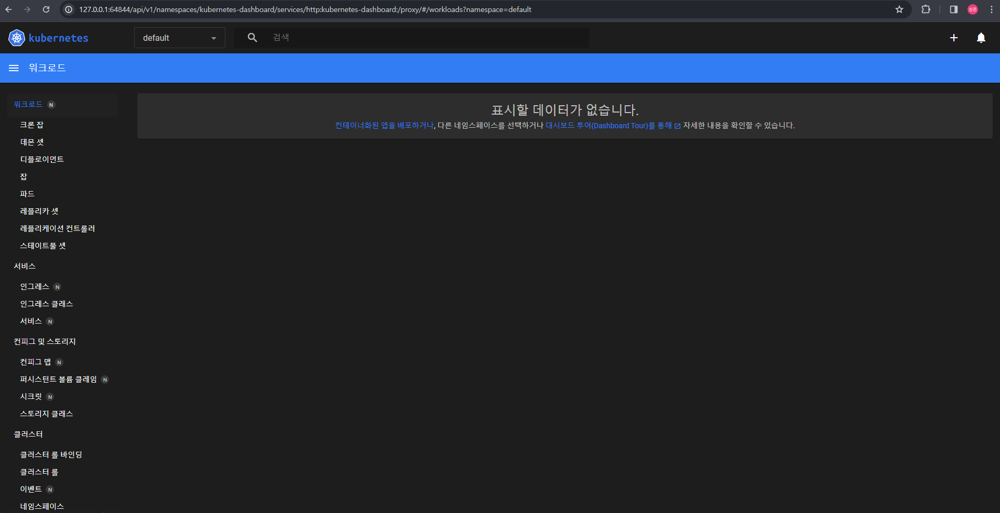

- [minikube start](https://minikube.sigs.k8s.io/docs/start/)
- [Hello-Minikube](https://kubernetes.io/ko/docs/tutorials/hello-minikube/)

# Minikube
- minikube start를 기준으로 진행함

## 요구사항
- 2 CPUs or more
- 2GB of free memory
- 20GB of free disk space
- Internet connection
- Container or virtual machine manager
    - such as: Docker, QEMU, Hyperkit, Hyper-V, KVM, Parallels, Podman, VirtualBox, or VMware Fusion/Workstation

## 참고
- [minikube_Cli](https://minikube.sigs.k8s.io/docs/commands/)

## 1. 설치
- 환경
    - 설정 : window, x86-64, stable, windows package manager
    - 터미널 : Windows Powershell 실해, 관리자권한
- 설치
```bash
winget install minikube

'msstore' 원본을 사용하려면 다음 계약을 확인해야 합니다.
Terms of Transaction: https://aka.ms/microsoft-store-terms-of-transaction
원본이 제대로 작동하려면 현재 컴퓨터의 두 글자 지리적 지역을 백 엔드 서비스로 보내야 합니다(예: "미국").

모든 원본 사용 약관에 동의하십니까?
[Y] 예  [N] 아니요: y
찾음 Kubernetes - Minikube - A Local Kubernetes Development Environment [Kubernetes.minikube] 버전 1.32.0
이 응용 프로그램의 라이선스는 그 소유자가 사용자에게 부여했습니다.
Microsoft는 타사 패키지에 대한 책임을 지지 않고 라이선스를 부여하지도 않습니다.
다운로드 중 https://github.com/kubernetes/minikube/releases/download/v1.32.0/minikube-installer.exe
  ██████████████████████████████  36.0 MB / 36.0 MB
설치 관리자 해시를 확인했습니다.
패키지 설치를 시작하는 중...
설치 성공
```

## 2.클러스터 시작하기
- 실행
```bash
minikube start

minikube : 'minikube' 용어가 cmdlet, 함수, 스크립트 파일 또는 실행할 수 있는 프로그램 이름으로 인식되지 않습니다. 이름이 정확한지 확인하고 경로가 포함된 경우 경로가 올바른지 검증한 다음 다시 시도하십시오.
위치 줄:1 문자:1
+ minikube start
+ ~~~~~~~~
    + CategoryInfo          : ObjectNotFound: (minikube:String) [], CommandNotFoundException
    + FullyQualifiedErrorId : CommandNotFoundException
```
- 오류해결
    - cmd(관리자)로 진행
```
C:\Windows\system32>minikube start                                                                                      W0308 09:44:03.925826   22636 main.go:291] Unable to resolve the current Docker CLI context "default": context "default": context not found: open C:\Users\CEO\.docker\contexts\meta\37a8eec1ce19687d132fe29051dca629d164e2c4958ba141d5f4133a33f0688f\meta.json: The system cannot find the path specified.                                                             * Microsoft Windows 10 Pro 10.0.19045.4046 Build 19045.4046 의 minikube v1.32.0
* 자동적으로 hyperv 드라이버가 선택되었습니다
* 가상 머신 부트 이미지 다운로드 중 ...
    > minikube-v1.32.1-amd64.iso....:  65 B / 65 B [---------] 100.00% ? p/s 0s
    > minikube-v1.32.1-amd64.iso:  292.96 MiB / 292.96 MiB  100.00% 30.44 MiB p
* minikube 클러스터의 minikube 컨트롤 플레인 노드를 시작하는 중
* 쿠버네티스 v1.28.3 을 다운로드 중 ...
    > preloaded-images-k8s-v18-v1...:  403.35 MiB / 403.35 MiB  100.00% 30.96 M
* hyperv VM (CPUs=2, Memory=6000MB, Disk=20000MB) 를 생성하는 중 ...
* 쿠버네티스 v1.28.3 을 Docker 24.0.7 런타임으로 설치하는 중
  - 인증서 및 키를 생성하는 중 ...
  - 컨트롤 플레인이 부팅...
  - RBAC 규칙을 구성하는 중 ...
* Configuring bridge CNI (Container Networking Interface) ...
* Kubernetes 구성 요소를 확인...
  - Using image gcr.io/k8s-minikube/storage-provisioner:v5
* 애드온 활성화 : storage-provisioner, default-storageclass
* 끝났습니다! kubectl이 "minikube" 클러스터와 "default" 네임스페이스를 기본적으로 사용하도록 구성되었습니다.
```

## 3. 클러스터와 상호작용하기
- kubectl 설치하기
```bash
kubectl get po -A

NAMESPACE     NAME                               READY   STATUS    RESTARTS        AGE
kube-system   coredns-5dd5756b68-8qkwn           1/1     Running   0               7m54s
kube-system   etcd-minikube                      1/1     Running   0               8m7s
kube-system   kube-apiserver-minikube            1/1     Running   0               8m7s
kube-system   kube-controller-manager-minikube   1/1     Running   0               8m7s
kube-system   kube-proxy-wccr5                   1/1     Running   0               7m54s
kube-system   kube-scheduler-minikube            1/1     Running   0               8m7s
kube-system   storage-provisioner                1/1     Running   1 (7m24s ago)   8m6s

# minikube kubectl -- get po -A 를 통해서 kubectl 버전을 설정 할 수 있다.
C:\Windows\system32>minikube kubectl -- get po -A

W0308 09:53:29.813912   15120 main.go:291] Unable to resolve the current Docker CLI context "default": context "default": context not found: open C:\Users\CEO\.docker\contexts\meta\37a8eec1ce19687d132fe29051dca629d164e2c4958ba141d5f4133a33f0688f\meta.json: The system cannot find the path specified.
    > kubectl.exe.sha256:  64 B / 64 B [---------------------] 100.00% ? p/s 0s
    > kubectl.exe:  48.25 MiB / 48.25 MiB [----------] 100.00% 3.58 MiB p/s 14s
NAMESPACE     NAME                               READY   STATUS    RESTARTS        AGE
kube-system   coredns-5dd5756b68-8qkwn           1/1     Running   0               8m26s
kube-system   etcd-minikube                      1/1     Running   0               8m39s
kube-system   kube-apiserver-minikube            1/1     Running   0               8m39s
kube-system   kube-controller-manager-minikube   1/1     Running   0               8m39s
kube-system   kube-proxy-wccr5                   1/1     Running   0               8m26s
kube-system   kube-scheduler-minikube            1/1     Running   0               8m39s
kube-system   storage-provisioner                1/1     Running   1 (7m56s ago)   8m38s
```
```bash
C:\Windows\system32>minikube dashboard

W0308 14:12:58.124371   13472 main.go:291] Unable to resolve the current Docker CLI context "default": context "default": context not found: open C:\Users\CEO\.docker\contexts\meta\37a8eec1ce19687d132fe29051dca629d164e2c4958ba141d5f4133a33f0688f\meta.json: The system cannot find the path specified.
* 대시보드를 활성화하는 중 ...
  - Using image docker.io/kubernetesui/dashboard:v2.7.0
  - Using image docker.io/kubernetesui/metrics-scraper:v1.0.8
* Some dashboard features require the metrics-server addon. To enable all features please run:

        minikube addons enable metrics-server


* Dashboard 의 상태를 확인 중입니다 ...
* 프록시를 시작하는 중 ...
* Proxy 의 상태를 확인 중입니다 ...
* Opening http://127.0.0.1:64844/api/v1/namespaces/kubernetes-dashboard/services/http:kubernetes-dashboard:/proxy/ in your default browser...
```

- dashboard 실행으로 인해 새로운 관리자cmd창을 추가로 띄워 진행했습니다.

## 4. 앱배포
- Ingress
```bash
C:\Windows\system32>minikube addons enable ingress

W0308 14:20:25.658513   25552 main.go:291] Unable to resolve the current Docker CLI context "default": context "default": context not found: open C:\Users\CEO\.docker\contexts\meta\37a8eec1ce19687d132fe29051dca629d164e2c4958ba141d5f4133a33f0688f\meta.json: The system cannot find the path specified.
* ingress is an addon maintained by Kubernetes. For any concerns contact minikube on GitHub.
You can view the list of minikube maintainers at: https://github.com/kubernetes/minikube/blob/master/OWNERS
  - Using image registry.k8s.io/ingress-nginx/kube-webhook-certgen:v20231011-8b53cabe0
  - Using image registry.k8s.io/ingress-nginx/controller:v1.9.4
  - Using image registry.k8s.io/ingress-nginx/kube-webhook-certgen:v20231011-8b53cabe0
* ingress 애드온을 확인 중입니다 ...
* 'ingress' 애드온이 활성화되었습니다
```
- ingress-example.yaml 파일을 적용시킵니다.
    - 제공되는 샘플 파일이며 다음과 같습니다.
    ```yaml
    kind: Pod
    apiVersion: v1
    metadata:
    name: foo-app
    labels:
        app: foo
    spec:
    containers:
        - name: foo-app
        image: 'kicbase/echo-server:1.0'
    ---
    kind: Service
    apiVersion: v1
    metadata:
    name: foo-service
    spec:
    selector:
        app: foo
    ports:
        - port: 8080
    ---
    kind: Pod
    apiVersion: v1
    metadata:
    name: bar-app
    labels:
        app: bar
    spec:
    containers:
        - name: bar-app
        image: 'kicbase/echo-server:1.0'
    ---
    kind: Service
    apiVersion: v1
    metadata:
    name: bar-service
    spec:
    selector:
        app: bar
    ports:
        - port: 8080
    ---
    apiVersion: networking.k8s.io/v1
    kind: Ingress
    metadata:
    name: example-ingress
    spec:
    rules:
        - http:
            paths:
            - pathType: Prefix
                path: /foo
                backend:
                service:
                    name: foo-service
                    port:
                    number: 8080
            - pathType: Prefix
                path: /bar
                backend:
                service:
                    name: bar-service
                    port:
                    number: 8080
    ---
    ```
- 서비스를 적용시킵니다.
```bash
kubectl apply -f https://storage.googleapis.com/minikube-site-examples/ingress-example.yaml

C:\Windows\system32>kubectl apply -f https://storage.googleapis.com/minikube-site-examples/ingress-example.yaml
pod/foo-app created
service/foo-service created
pod/bar-app created
service/bar-service created
ingress.networking.k8s.io/example-ingress created
```
- ingress 정보를 가져옵니다
```bash
C:\Windows\system32>kubectl get ingress

NAME              CLASS   HOSTS   ADDRESS          PORTS   AGE
example-ingress   nginx   *       172.24.158.139   80      85s
```

- 테스트하기1
```bash
C:\Windows\system32>curl 172.24.158.139/foo

Request served by foo-app

HTTP/1.1 GET /foo

Host: 172.24.158.139
Accept: */*
User-Agent: curl/8.4.0
X-Forwarded-For: 172.24.144.1
X-Forwarded-Host: 172.24.158.139
X-Forwarded-Port: 80
X-Forwarded-Proto: http
X-Forwarded-Scheme: http
X-Real-Ip: 172.24.144.1
X-Request-Id: caba2288de6c23816ab5ab5b6b1d095b
X-Scheme: http
```

- 테스트하기2
```bash
C:\Windows\system32>curl 172.24.158.139/bar

Request served by bar-app

HTTP/1.1 GET /bar

Host: 172.24.158.139
Accept: */*
User-Agent: curl/8.4.0
X-Forwarded-For: 172.24.144.1
X-Forwarded-Host: 172.24.158.139
X-Forwarded-Port: 80
X-Forwarded-Proto: http
X-Forwarded-Scheme: http
X-Real-Ip: 172.24.144.1
X-Request-Id: c50e827c921154b94e527d76fd1e1685
X-Scheme: http
```

## 5. 클러스터 관리
- minikube 일시정지
```bash
minikube pause

C:\Windows\system32>minikube pause
W0308 14:35:09.374251   15364 main.go:291] Unable to resolve the current Docker CLI context "default": context "default": context not found: open C:\Users\CEO\.docker\contexts\meta\37a8eec1ce19687d132fe29051dca629d164e2c4958ba141d5f4133a33f0688f\meta.json: The system cannot find the path specified.
* Pausing node minikube ...
* Paused 18 containers in: kube-system, kubernetes-dashboard, storage-gluster, istio-operator
```
- minikube 일시정지해제
```bash
minikube unpause

C:\Windows\system32>minikube unpause
W0308 14:38:35.302229   24132 main.go:291] Unable to resolve the current Docker CLI context "default": context "default": context not found: open C:\Users\CEO\.docker\contexts\meta\37a8eec1ce19687d132fe29051dca629d164e2c4958ba141d5f4133a33f0688f\meta.json: The system cannot find the path specified.
* Unpausing node minikube ...
* Unpaused 18 containers in: kube-system, kubernetes-dashboard, storage-gluster, istio-operator
```
- local Kubernetes cluster를 정지합니다.
```bash
minikube stop

C:\Windows\system32>minikube stop
W0308 14:43:12.618991   10712 main.go:291] Unable to resolve the current Docker CLI context "default": context "default": context not found: open C:\Users\CEO\.docker\contexts\meta\37a8eec1ce19687d132fe29051dca629d164e2c4958ba141d5f4133a33f0688f\meta.json: The system cannot find the path specified.
* "minikube" 노드를 중지하는 중 ...
* "minikube"를 SSH로 전원을 끕니다 ...
* 1개의 노드가 중지되었습니다.
```
- local Kubernetes cluster를 시작합니다.
```bash
minikube start

C:\Windows\system32>minikube start
W0308 14:43:49.762012    7228 main.go:291] Unable to resolve the current Docker CLI context "default": context "default": context not found: open C:\Users\CEO\.docker\contexts\meta\37a8eec1ce19687d132fe29051dca629d164e2c4958ba141d5f4133a33f0688f\meta.json: The system cannot find the path specified.
* Microsoft Windows 10 Pro 10.0.19045.4046 Build 19045.4046 의 minikube v1.32.0
* 기존 프로필에 기반하여 hyperv 드라이버를 사용하는 중
* minikube 클러스터의 minikube 컨트롤 플레인 노드를 시작하는 중
* Restarting existing hyperv VM for "minikube" ...
* 쿠버네티스 v1.28.3 을 Docker 24.0.7 런타임으로 설치하는 중
* Configuring bridge CNI (Container Networking Interface) ...
* Kubernetes 구성 요소를 확인...
  - Using image registry.k8s.io/ingress-nginx/kube-webhook-certgen:v20231011-8b53cabe0
  - Using image registry.k8s.io/ingress-nginx/kube-webhook-certgen:v20231011-8b53cabe0
  - Using image registry.k8s.io/ingress-nginx/controller:v1.9.4
  - Using image docker.io/kubernetesui/dashboard:v2.7.0
  - Using image gcr.io/k8s-minikube/storage-provisioner:v5
  - Using image docker.io/kubernetesui/metrics-scraper:v1.0.8
* ingress 애드온을 확인 중입니다 ...
* Some dashboard features require the metrics-server addon. To enable all features please run:

        minikube addons enable metrics-server


* 애드온 활성화 : storage-provisioner, ingress, dashboard, default-storageclass
* 끝났습니다! kubectl이 "minikube" 클러스터와 "default" 네임스페이스를 기본적으로 사용하도록 구성되었습니다.
```


```bash
minikube config set memory 9001

C:\Windows\system32>minikube config set memory 9001
W0308 14:46:31.789886   19400 main.go:291] Unable to resolve the current Docker CLI context "default": context "default": context not found: open C:\Users\CEO\.docker\contexts\meta\37a8eec1ce19687d132fe29051dca629d164e2c4958ba141d5f4133a33f0688f\meta.json: The system cannot find the path specified.
! These changes will take effect upon a minikube delete and then a minikube start
```
- 사용가능한 에드온리스트 가져오기
```bash
minikube addons list

C:\Windows\system32>minikube addons list
W0308 14:39:11.619521   23460 main.go:291] Unable to resolve the current Docker CLI context "default": context "default": context not found: open C:\Users\CEO\.docker\contexts\meta\37a8eec1ce19687d132fe29051dca629d164e2c4958ba141d5f4133a33f0688f\meta.json: The system cannot find the path specified.
|-----------------------------|----------|--------------|--------------------------------|
|         ADDON NAME          | PROFILE  |    STATUS    |           MAINTAINER           |
|-----------------------------|----------|--------------|--------------------------------|
| ambassador                  | minikube | disabled     | 3rd party (Ambassador)         |
| auto-pause                  | minikube | disabled     | minikube                       |
| cloud-spanner               | minikube | disabled     | Google                         |
| csi-hostpath-driver         | minikube | disabled     | Kubernetes                     |
| dashboard                   | minikube | enabled ✅   | Kubernetes                     |
| default-storageclass        | minikube | enabled ✅   | Kubernetes                     |
| efk                         | minikube | disabled     | 3rd party (Elastic)            |
| freshpod                    | minikube | disabled     | Google                         |
| gcp-auth                    | minikube | disabled     | Google                         |
| gvisor                      | minikube | disabled     | minikube                       |
| headlamp                    | minikube | disabled     | 3rd party (kinvolk.io)         |
| helm-tiller                 | minikube | disabled     | 3rd party (Helm)               |
| inaccel                     | minikube | disabled     | 3rd party (InAccel             |
|                             |          |              | [info@inaccel.com])            |
| ingress                     | minikube | enabled ✅   | Kubernetes                     |
| ingress-dns                 | minikube | disabled     | minikube                       |
| inspektor-gadget            | minikube | disabled     | 3rd party                      |
|                             |          |              | (inspektor-gadget.io)          |
| istio                       | minikube | disabled     | 3rd party (Istio)              |
| istio-provisioner           | minikube | disabled     | 3rd party (Istio)              |
| kong                        | minikube | disabled     | 3rd party (Kong HQ)            |
| kubeflow                    | minikube | disabled     | 3rd party                      |
| kubevirt                    | minikube | disabled     | 3rd party (KubeVirt)           |
| logviewer                   | minikube | disabled     | 3rd party (unknown)            |
| metallb                     | minikube | disabled     | 3rd party (MetalLB)            |
| metrics-server              | minikube | disabled     | Kubernetes                     |
| nvidia-device-plugin        | minikube | disabled     | 3rd party (NVIDIA)             |
| nvidia-driver-installer     | minikube | disabled     | 3rd party (Nvidia)             |
| nvidia-gpu-device-plugin    | minikube | disabled     | 3rd party (Nvidia)             |
| olm                         | minikube | disabled     | 3rd party (Operator Framework) |
| pod-security-policy         | minikube | disabled     | 3rd party (unknown)            |
| portainer                   | minikube | disabled     | 3rd party (Portainer.io)       |
| registry                    | minikube | disabled     | minikube                       |
| registry-aliases            | minikube | disabled     | 3rd party (unknown)            |
| registry-creds              | minikube | disabled     | 3rd party (UPMC Enterprises)   |
| storage-provisioner         | minikube | enabled ✅   | minikube                       |
| storage-provisioner-gluster | minikube | disabled     | 3rd party (Gluster)            |
| storage-provisioner-rancher | minikube | disabled     | 3rd party (Rancher)            |
| volumesnapshots             | minikube | disabled     | Kubernetes                     |
|-----------------------------|----------|--------------|--------------------------------|
```

```bash
minikube start -p aged --kubernetes-version=v1.16.1
```

```bash
minikube delete --all
```